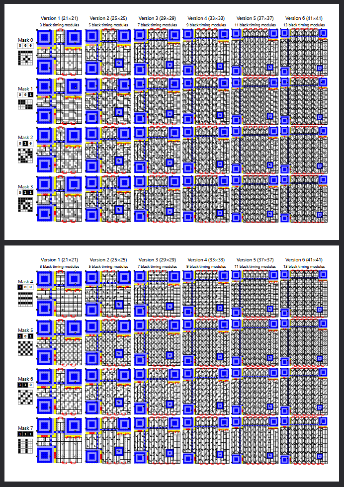

# QR Code Cheat Sheet

An overview of all 48 combinations of Version 1-6 QR codes with all 8 mask patterns. Useful for the art of [decoding QR codes by hand](https://qr.blinry.org/).

[View the PDF here](https://benjaminaster.github.io/qr-code-cheat-sheet/qr-code-cheat-sheet.pdf)

